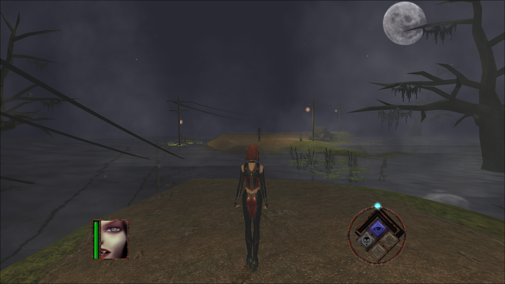
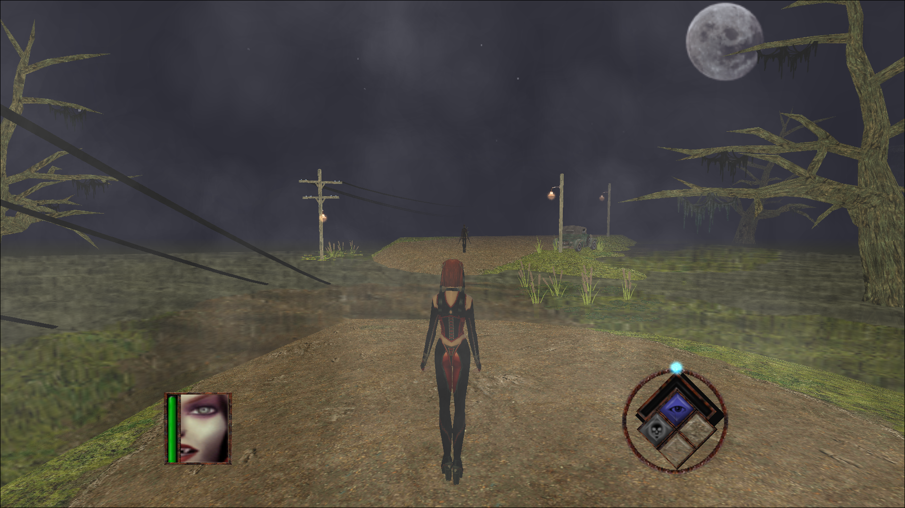
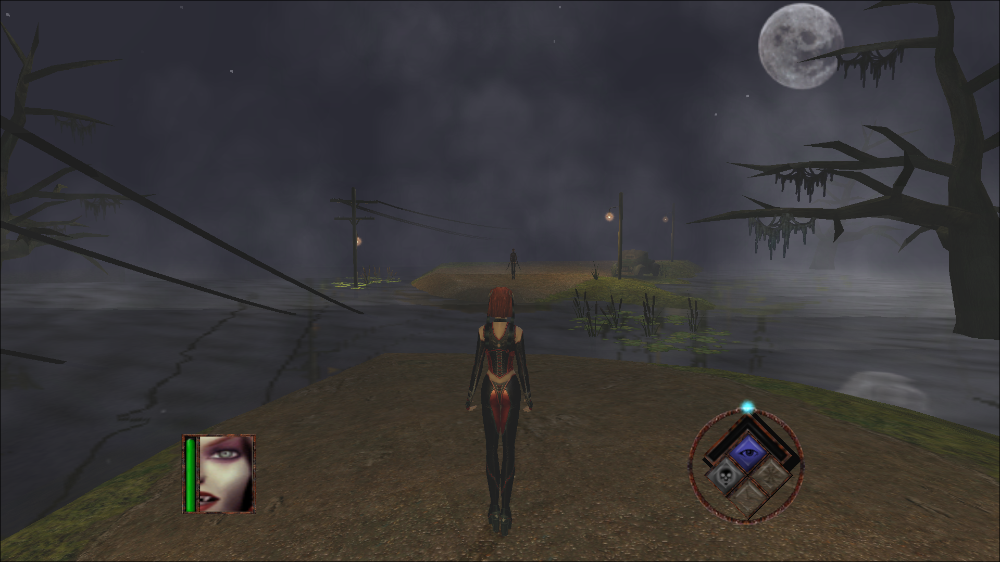

# Red Rayne

## Project
Red Rayne is a open source implementation of Terminal Reality's [BloodRayne](https://en.wikipedia.org/wiki/BloodRayne_(video_game)) from early 2000s.

## Goal
There are multiple goals this project tries to achieve:
1. Learn how games were made in an era when things had to be done in the code, and not through fancy game engines like today.
2. Have a fully playable game implemented end-to-end, including resource management, audio, and video rendering, as well as support of large screen resolutions.
3. Eventually, to support 64-bit compilation for modern systems, and provide an avenue for development of modern renderer implementations such as DirectX or Vulkan.
4. Also, eventually, to support modern input devices that do not comply with DirectInput, and even port to Linux or Mac.

The game is heavily dependent on Windows API, these calls are sprinkled all over the code base, not to mention use of Windows-only APIs like DirectSound and DirectInput. I **do not** intend to port the game to other platforms, you are welcome though.

## Requirements & Dependencies
1. [Microsoft Visual Studio](https://visualstudio.microsoft.com/downloads/)
2. [Microsoft DirectX 8.1 SDK](https://archive.org/details/dx81sdk_full)
3. [Microsoft DirectX 9.0 SDK (June 2010)](https://www.microsoft.com/en-US/download/details.aspx?id=6812) 

## Screen Shots
### DirectX 8.1 T&L

### OpenGL 1.2

### DirectX 9.0 T&L

The DirectX 9.0 renderer is an upgrade to the DirectX 8.1 renderer. It is an important step towards the future 64-bit compatibility.

## Notes
1. I used GOG.com's version [17893](https://www.google.com/search?q=setup_bloodrayne_gog-1_(17893).exe) of the game.
2. The DirectX 8.1 T&L renderer has the original shaders, as they come with the game. They contains debug information, thus, if you compile disassembled shaders, you will get way smaller payloads.

## Thanks
1. [d3d8to9](https://github.com/crosire/d3d8to9) for the insights and the details for the upgrade to DirectX 9.0 above and beyond what Microsoft's article [Converting to Direct3D 9](https://learn.microsoft.com/en-us/windows/win32/direct3d9/converting-to-directx-9) provides.
2. [GamePressure](https://www.gamepressure.com/download.asp?ID=2151) for the demo version of the game.

## Legal
1. This is not a complete game. Please purchase software you like!
2. The source code in this repository is mostly produced by reverse engineering the original binaries. There are a couple of exceptions for reverse engineering under DMCA -- documentation, interoperability, fair use. See goals section for the interoperability and fair use cases. The documentation is needed to support those.
3. BloodRayne, DirectX, OpenGL, Vulkan, and others are trademarks of their respective owners.

